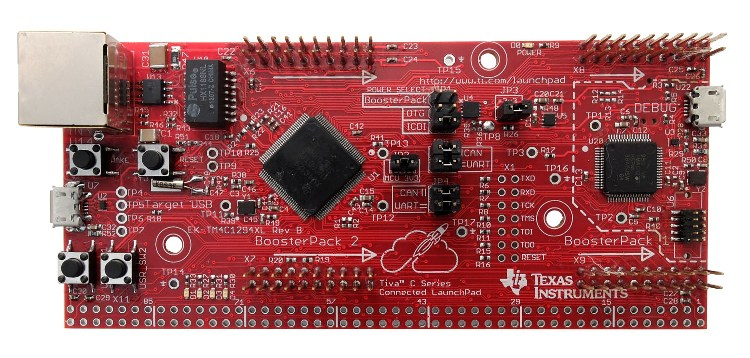
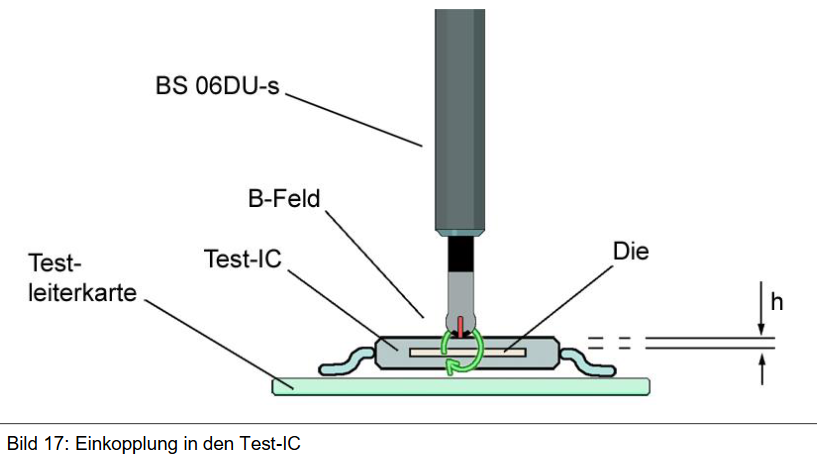
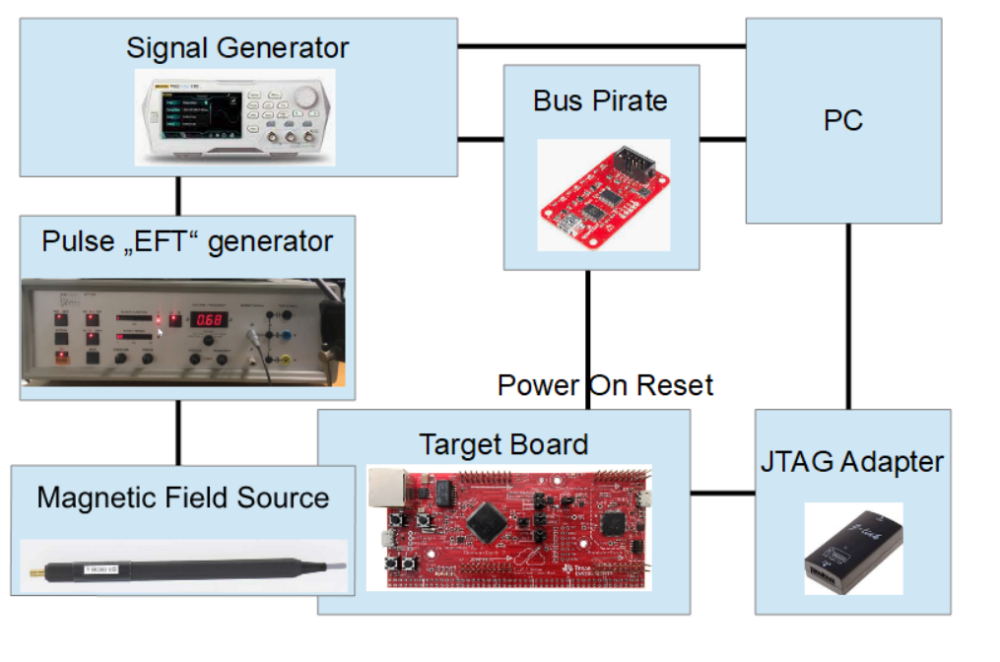
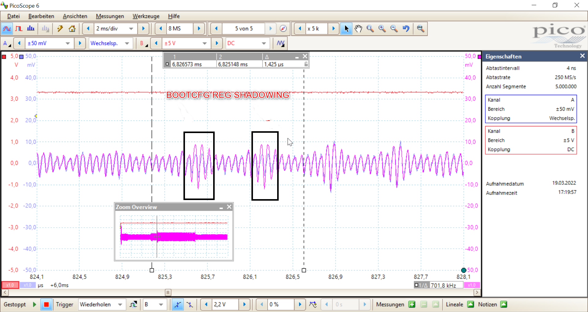
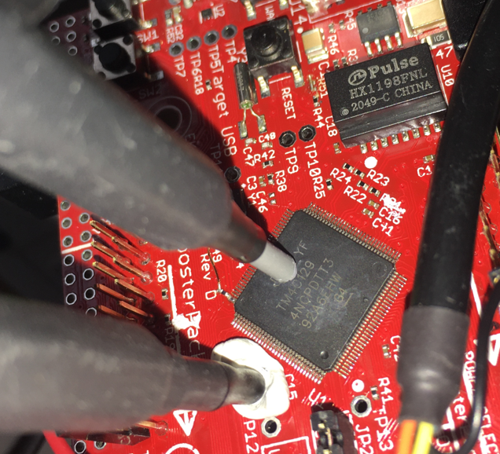
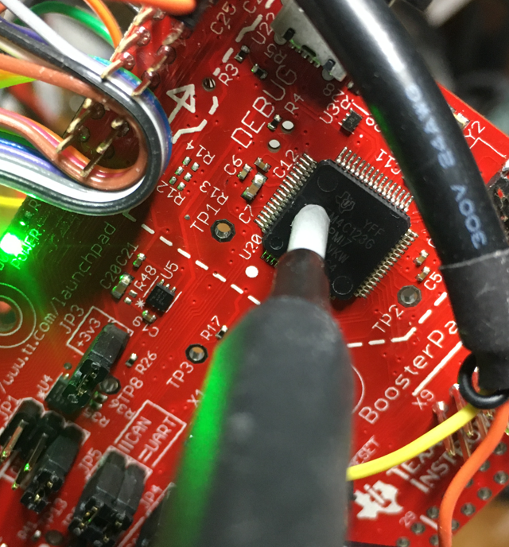
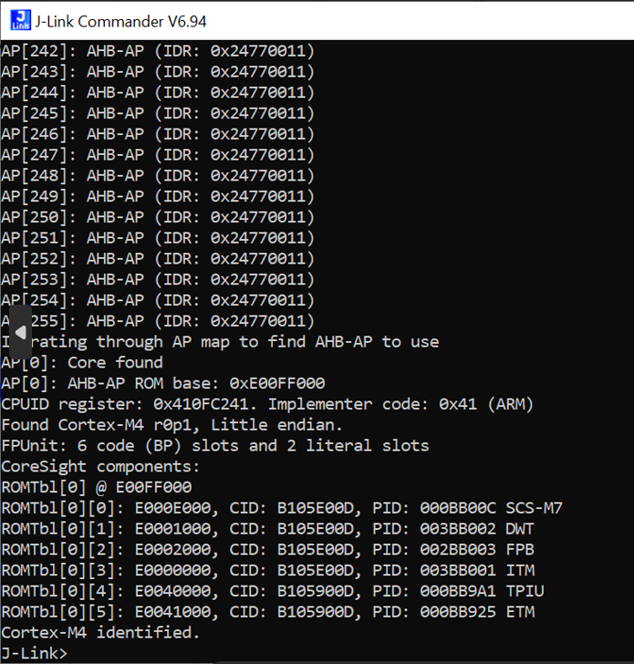

This is a description of a successful JTAG resurrection :ghost: attack with Electromagnetic Fault Injection (yet another EM-FI) against the Texas Instrument [TM4C12x microcontroller family](https://www.ti.com/microcontrollers-mcus-processors/arm-based-microcontrollers/arm-cortex-m4-mcus/overview.html). First the target and the fault injection mechanism are described, then the attack itself.

# The actors

## Victim: TM4C12x microcontroller

... or more precisely, the TM4C12x JTAG Disabling Mechanism. This ARM Cortex M4 based microcontroller has an embedded flash memory and a mechanism to secure JTAG access. More can be found in the [datasheet](https://www.ti.com/lit/ds/symlink/tm4c129encpdt.pdf). In case of no other protection mechanisms such as flash protection, JTAG access enables an attacker to extract and debug the firmware. Therefore, JTAG is normally disabled on production devices. Here is how JTAG can be disabled on the TM4C12x (from the datasheet):

> Permanently Disabling Debug: For extremely sensitive applications, the debug interface to the processor and peripherals can be permanently disabled, blocking all accesses to the device through the JTAG or SWD interfaces. With the debug interface disabled, it is still possible to perform standard IEEE instructions (such as boundary scan operations), but access to the processor and peripherals is blocked. The DBG0 and DBG1 bits of the Boot Configuration (BOOTCFG) register control whether the debug interface is turned on or off. The debug interface should not be permanently disabled without providing some mechanism, such as the boot loader, to provide customer-installable updates or bug fixes. Disabling the debug interface is permanent and cannot be reversed.

According to the datasheet there is also a mechanism to **unlock** the device -- but this comes at a price: in this case the flash memory is completely erased.

During each boot time, the `BOOTCFG` register is read and JTAG protection is enabled. If an attacker manages to induce some internal faults during boot and change some branches, JTAG may be left unprotected -- that's the rough idea.  

The EK-TM4C1294XL evaluation kit featuring a TCM4C129 (left) and a TM4C123 (right) is a perfect testing target (I bricked two of them):

## Attacker: Electromagnetic Fault Injection

Roughly said, by generating a transient magnetic field near the device, some current is induced into the internal device wires and **may** produce some interesting faults. This picture from the [probe user manual](https://www.langer-emv.de/fileadmin/2020.06.17%20H5-IC%20set%20user%20manual.pdf) explains the coupling mechanism:

I'm using an old, modified *Electrical Fast Transient* ([EFT](https://transientspecialists.com/blogs/blog/electrical-fast-transient-burst-iec-61000-4-4)) generator normally used in EMC tests, combined with a [Langer EMV BS 06DB magnetic field source](https://www.langer-emv.de/en/product/eft-coupling/55/h4-ic-set-eft-burst-magnetic-field-source/429/bs-06db-s-eft-burst-magnetic-field-source/430) and a signal generator used as a programmable delay generator. I had to modify the EFT generator by adding an external, jitter-free trigger input as we need very precise, reproducible *timing*.

Since the fault has to be generated at boot time, the `RESET` signal of the microcontroller is used as the **primary** trigger. This primary trigger is generated by a [Bus Pirate](http://dangerousprototypes.com/docs/Bus_Pirate) which is attached to a PC. The Bus Pirate is also connected to the external input of our signal generator. It generates a **secondary** trigger after a programmable delay `T` in order to trigger the EFT generator (i.e., the pulse). The target device is connected via a [J-Link](https://www.segger.com/products/debug-probes/j-link/) JTAG adapter to a PC which orchestrates the setup. These are the following testing steps:

1. Program the signal generator with a timing `T`
2. Trigger the signal generator and the target power-on `RESET` with the Bus Pirate. After `T`, the signal generator triggers the pulse.
3. Test the JTAG connection. If JTAG is available then stop (and be relieved :relieved:), otherwise go back to step 1) and cry :cry:

Here is a block diagram of the setup:

The *placement* of the probe over the chip is also a critical parameter. An automatic XY-Table can do the job (would be a nice to have), however manual positioning is possible, too.

Last but not least, the *amplitude and polarity* of the pulse have to be chosen. Normally, interesting faults appear at the border between "no fault at all" and "global reset".

# PoC

## Act I: Find the correct parameters

The determination of the physical parameters is the most crucial part of the attack. The following parameters are required:

* Timing 
* Probe placement
* Pulse amplitude and polarity

Here is a method on how to find the timing (the most difficult one) for such an EM-FI attack:

1. Take a device with JTAG *enabled* and measure the current consumption during boot (this is also called *side channel*).
2. Take a device with JTAG *disabled* and do the same.
3. Compare the waveform to find the correct timing.

Here is a screenshot of the waveform for the two different cases:

Note, that the reproducibility of the attack will suffer from the clock jitter (the device boots most probably with an internal RC-Oscillator).

The current consumption has been measured with a magnetic field probe placed close to a capacitor on the board.

For the other parameters, an *educated guess* approach combined with trial and error was followed. The pulse amplitude has been set to `+750 V` for a successful attack.

Once an approximate set of parameters has been defined, a parameter "brute force" search can be started.

## Act II: Boom

After many hours, I was eventually able to re-enable (resurrect) the JTAG on the two ICs in a reproducible way. Here is a picture of the magnetic field source on the TM4C129. The second probe is a magnetic field probe to measure the current consumption -- alias *side channel* -- near an external decoupling capacitor.

And here on the TM4C123:

And this is what happens when JTAG is resurrected:

# Responsible Disclosure

I disclosed my finding to Texas Instrument in August 2022. They answered with [this document](https://www.ti.com/lit/ml/swra739/swra739.pdf). For the TM4C12x, there is no claim to be secure against such attacks.

# Acknowledgements

Many thanks to [stulle123](https://github.com/stulle123) for the review.
